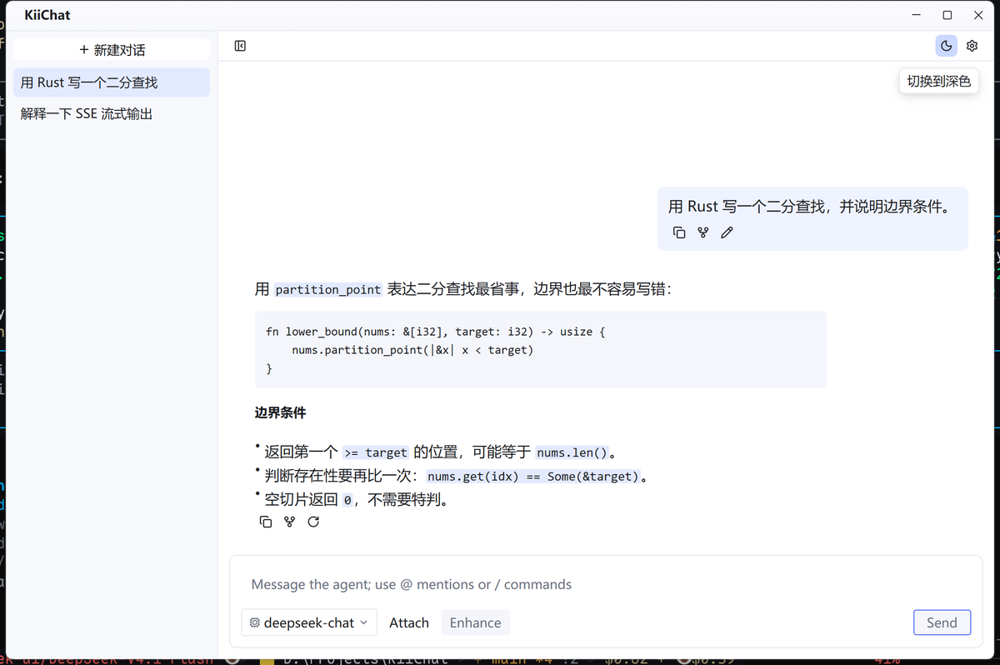
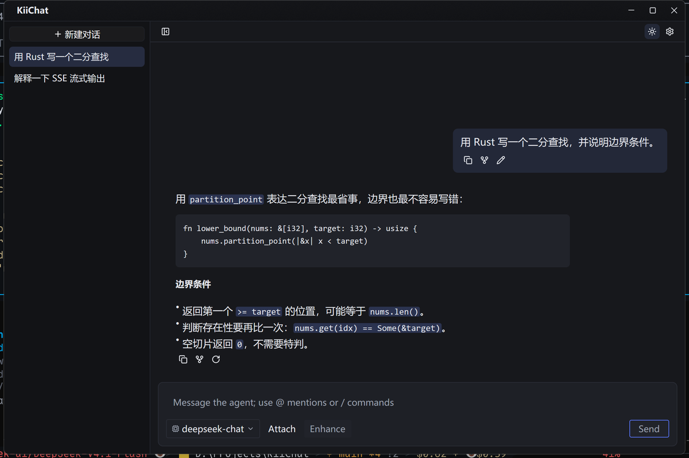
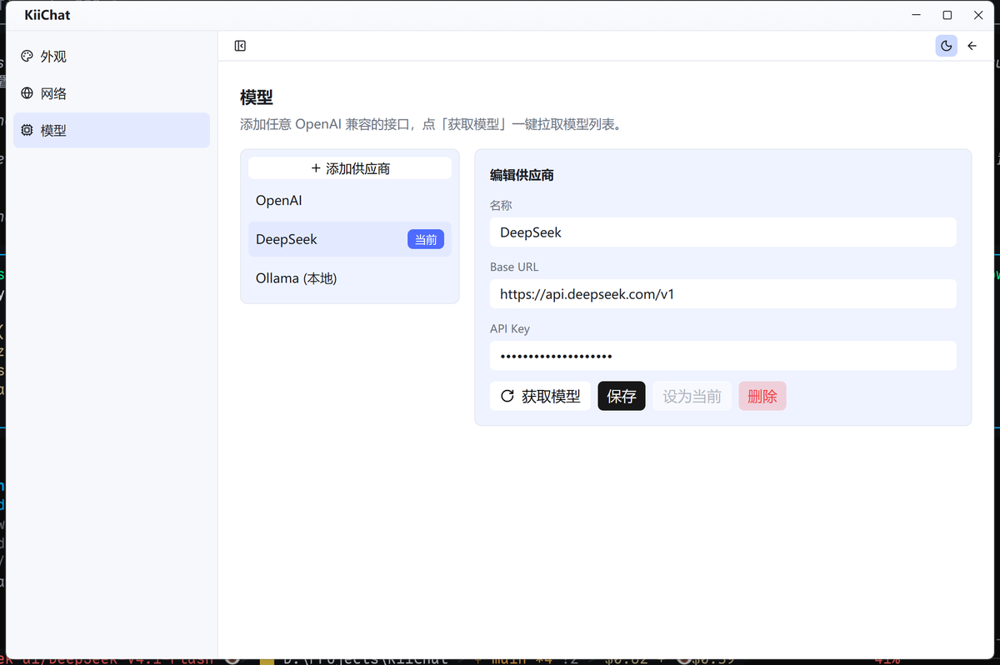

# KiiChat

一个轻量的、Cherry Studio 风格的桌面大模型聊天客户端，使用 [GPUI](https://gpui.rs)（Zed 的 GPU 加速 UI 框架）编写：添加任意 OpenAI 兼容的接口，一键拉取模型列表，然后直接开聊。



<details>
<summary>深色模式</summary>



</details>

<details>
<summary>设置 · 模型</summary>



</details>

## 功能

- **模型供应商**：填写 Base URL 与 API Key，点一次「获取模型」从 `{base_url}/models` 拉取模型列表；竖向列表维护多个供应商，随时切换「当前」。
- **会话管理**：左侧竖向会话列表，新建 / 切换 / 删除，标题自动取自第一条消息。
- **流式对话**：SSE 逐字输出，Markdown 渲染（含代码块高亮）；消息下方的方形图标按钮提供「复制 / 分支 / 重试」，用户消息另外可以「编辑」并重发。回复失败时重试按钮会展开成红色的「重试」，失败原因直接显示在气泡里。
- **折叠侧边栏**：一键收起会话列表，专注当前对话，状态会记住。
- **分支会话**：以任意一条消息为起点分叉出一个新会话，原会话保持不变。
- **代理设置**：跟随系统（读系统与环境变量）、不使用代理、自定义代理（例如 `http://127.0.0.1:7890`）三选一。
- **深浅色主题**：一键切换并持久化，使用 DeepSeek 官网风格的浅蓝配色。
- **自绘标题栏**：无系统边框，窗口控件与主题配色一致；窗口标题只在标题栏出现，侧边栏不再重复。
- **纯本地**：全部状态存于一个 JSON 文件，没有服务端、没有账号、没有遥测。
- **单文件二进制**，启动即用。

## 快速开始

需要 Rust 1.85 以上（edition 2024）。

```sh
git clone https://github.com/luzov/KiiChat.git
cd KiiChat
cargo run --release
```

配置文件位置（删掉即可重置全部状态）：

| 系统 | 路径 |
| --- | --- |
| Windows | `%APPDATA%\KiiChat\config.json` |
| Linux | `~/.config/KiiChat/config.json` |
| macOS | `~/Library/Application Support/KiiChat/config.json` |

## 使用

1. 左下角点「设置」，进入 **模型** 分项，点「添加供应商」，填名称、Base URL、API Key。
   Base URL 填接口根地址即可，例如 `https://api.openai.com/v1`；只填 `https://api.deepseek.com` 会自动补上 `/v1`。
2. 点「获取模型」拉取该接口的模型列表，再点「保存」。
3. 回到对话，在输入框左下角选择模型，输入内容后回车发送。
4. 网络需要代理时，到 **网络** 分项选择「自定义代理」并填地址（如 `http://127.0.0.1:7890`），点「应用」。

## 兼容性

任何实现了 `GET /models` 和 `POST /chat/completions`（`stream: true`）的 OpenAI 兼容接口都可以直接使用，例如：

- OpenAI、DeepSeek、Moonshot / Kimi、智谱 GLM、SiliconFlow、OpenRouter
- 本地部署：Ollama（`http://localhost:11434/v1`）、vLLM、LM Studio、one-api / new-api 网关

## 已知限制

这是刻意做小的客户端，以下都不支持：

- 只有对话：没有工具调用、图片、文件附件、语音。
- 不显示 reasoning / 思考过程，只渲染最终回答。
- 没有系统提示词、temperature 等参数的自定义；不发多轮以外的上下文。
- 分支只是复制已有消息到新会话，不共享后续对话。
- 单窗口；会话历史整体存在一个 JSON 文件里，不会分页或归档。

## 开发

项目约定、架构说明与验证方法见 [AGENTS.md](AGENTS.md)。常用命令：

```sh
cargo build                  # 编译（debug）
cargo run                    # 启动窗口
cargo clippy --all-targets   # 静态检查
```

`scripts/` 下是开发期工具，用于在没有键盘、看不到画面的情况下验证界面：

- `scripts/mock_openai.py`：假的 OpenAI 兼容服务（`127.0.0.1:18080`），用于端到端验证流式对话与模型拉取。
- `scripts/uia.ps1` / `scripts/buttons.ps1`：打印窗口的无障碍树 / 按钮清单（名称、位置），确认界面真的渲染出来了。
- `scripts/invoke.ps1`、`scripts/click.ps1`：通过 UI Automation 调用按钮，或做 DPI 感知的合成点击。
- `scripts/capture.ps1`：按窗口实际像素截图（配 `PIL` 可做颜色验证）。

## 技术栈

| 部分 | 选型 |
| --- | --- |
| UI 框架 | GPUI（Zed 发布快照 `gpui-pre`）+ `gpui-pre-platform` |
| 控件与主题 | `gpui-component`（`Root`、`TitleBar`、Button、Input、主题令牌、`TextView`） |
| 对话界面 | `gpui-ai` 的 `PromptBar`（输入框）与 `StreamingText`（流式 Markdown）；气泡、消息动作、会话列表由本项目自己实现 |
| 网络 | `reqwest` + 独立线程上的 tokio 运行时，SSE 分片经 `async-channel` 回传 UI |
| 存储 | `serde` + `serde_json`，原子写入单个配置文件 |

## 许可

[MIT](LICENSE)